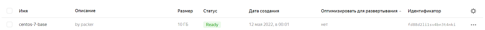
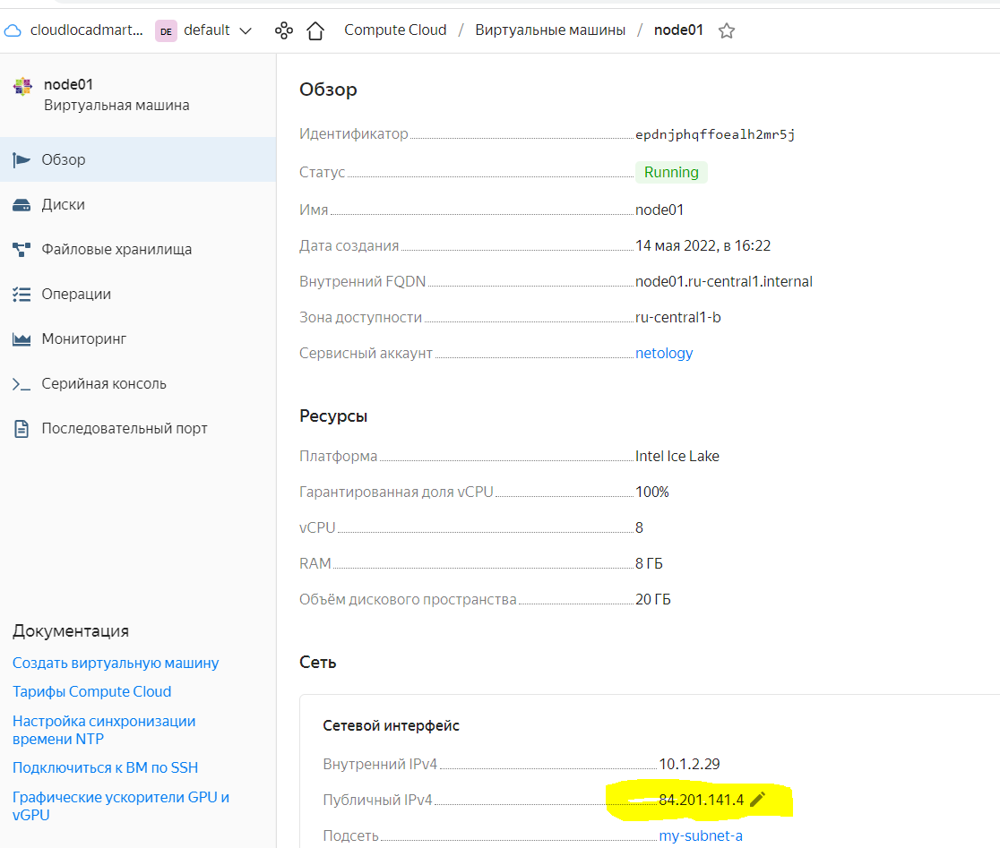
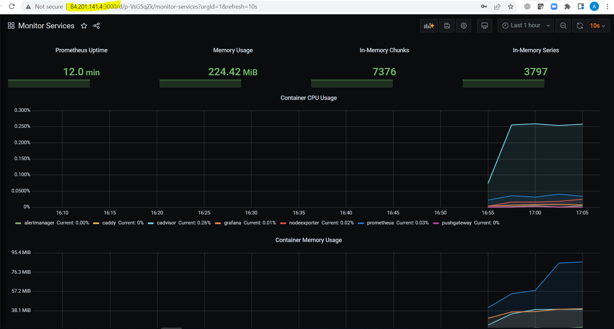

# Домашнее задание к занятию "5.4. Оркестрация группой Docker контейнеров на примере Docker Compose"

## Как сдавать задания

Обязательными к выполнению являются задачи без указания звездочки. Их выполнение необходимо для получения зачета и диплома о профессиональной переподготовке.

Задачи со звездочкой (*) являются дополнительными задачами и/или задачами повышенной сложности. Они не являются обязательными к выполнению, но помогут вам глубже понять тему.

Домашнее задание выполните в файле readme.md в github репозитории. В личном кабинете отправьте на проверку ссылку на .md-файл в вашем репозитории.

Любые вопросы по решению задач задавайте в чате учебной группы.

---

## Задача 1

Создать собственный образ операционной системы с помощью Packer.

```buildoutcfg
Создал сеть
yc vpc network list
+----------------------+---------+
|          ID          |  NAME   |
+----------------------+---------+
| enp23786k25r681ctn1t | default |
| enpen7b2h777vdlmbi34 | net     |

Версия пакер
turganovai@vds2260027:~/git/virt-homeworks$ packer version
Packer v1.8.0

turganovai@vds2260027:~/git/virt-homeworks$ yc vpc subnet list
+----------------------+-----------------------+----------------------+----------------+---------------+-----------------+
|          ID          |         NAME          |      NETWORK ID      | ROUTE TABLE ID |     ZONE      |      RANGE      |
+----------------------+-----------------------+----------------------+----------------+---------------+-----------------+
| e2l6ospinqqt1ciopklc | my-subnet-a           | enpen7b2h777vdlmbi34 |                | ru-central1-b | [10.1.2.0/24]   |

Создана машина
turganovai@vds2260027:~/git/virt-homeworks/05-virt-04-docker-compose/src/packer$ yc compute image list
+----------------------+---------------+--------+----------------------+--------+
|          ID          |     NAME      | FAMILY |     PRODUCT IDS      | STATUS |
+----------------------+---------------+--------+----------------------+--------+
| fd88d2li1sv4bn3t4nki | centos-7-base | centos | f2esd9f5o5i9p7pkkk8k | READY  |
```

Для получения зачета, вам необходимо предоставить:
- Скриншот страницы, как на слайде из презентации (слайд 37).
```buildoutcfg
На слайде 37 код ansible...

Образ ниже.
```

## Задача 2

```buildoutcfg
terraform
turganovai@vds2260027:~/git/virt-homeworks/05-virt-04-docker-compose/src/packer$ terraform --version
Terraform v1.1.9
on linux_amd64


Добавьте в презентацию добавление внутренних реестров яндекс

в фаил nano ~/.terraformrc
provider_installation {
  network_mirror {
    url = "https://terraform-mirror.yandexcloud.net/"
    include = ["registry.terraform.io/*/*"]
  }
  direct {
    exclude = ["registry.terraform.io/*/*"]
  }
}

Поднял машину
turganovai@vds2260027:~/git/virt-homeworks/05-virt-04-docker-compose/src/terraform$ yc compute instance list
+----------------------+--------+---------------+---------+--------------+-------------+
|          ID          |  NAME  |    ZONE ID    | STATUS  | EXTERNAL IP  | INTERNAL IP |
+----------------------+--------+---------------+---------+--------------+-------------+
| epdnjphqffoealh2mr5j | node01 | ru-central1-b | RUNNING | 84.201.141.4 | 10.1.2.29   |
+----------------------+--------+---------------+---------+--------------+-------------+
```

Создать вашу первую виртуальную машину в Яндекс.Облаке.

Для получения зачета, вам необходимо предоставить:
- Скриншот страницы свойств созданной ВМ, как на примере ниже:


Машина:


## Задача 3
```gitignore
turganovai@vds2260027:~/git/virt-homeworks/05-virt-04-docker-compose$ ansible --version
ansible [core 2.12.5]
  config file = /etc/ansible/ansible.cfg
  configured module search path = ['/home/turganovai/.ansible/plugins/modules', '/usr/share/ansible/plugins/modules']
  ansible python module location = /usr/lib/python3/dist-packages/ansible
  ansible collection location = /home/turganovai/.ansible/collections:/usr/share/ansible/collections
  executable location = /usr/bin/ansible
  python version = 3.8.10 (default, Mar 15 2022, 12:22:08) [GCC 9.4.0]
  jinja version = 3.1.2
  libyaml = True
  
  
 Есть проблематичные темы в вашем задание.
 При установке rsa_id.pub ключа, есть болезнь в Centos
  Permission denied (publickey,gssapi-keyex,gssapi-with-mic)
  Типовым образом подключится по SSH не возможно поскольку параметр в sshd_config 
  по умолчанию не стоит. А нужен:
  ChallengeResponseAuthentication no
  
  Результат установки ansible
```

Создать ваш первый готовый к боевой эксплуатации компонент мониторинга, состоящий из стека микросервисов.

Для получения зачета, вам необходимо предоставить:
- Скриншот работающего веб-интерфейса Grafana с текущими метриками, как на примере ниже
<p align="center">
  
</p>

## Задача 4 (*)

Создать вторую ВМ и подключить её к мониторингу развёрнутому на первом сервере.

Для получения зачета, вам необходимо предоставить:
- Скриншот из Grafana, на котором будут отображаться метрики добавленного вами сервера.

