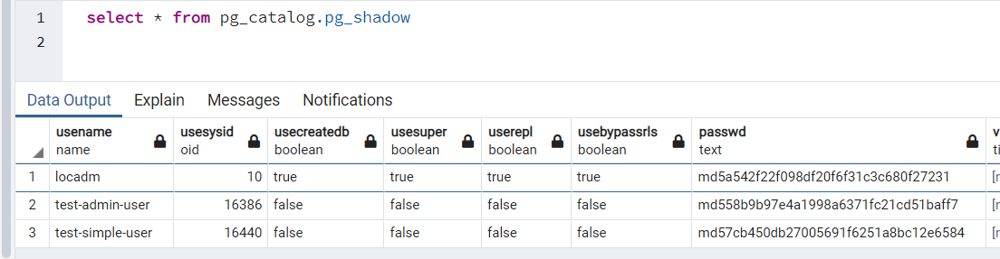
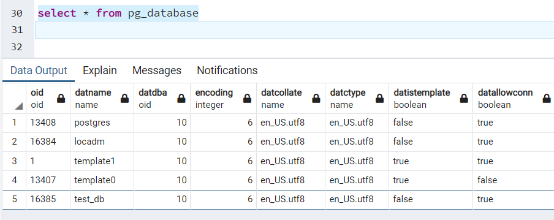
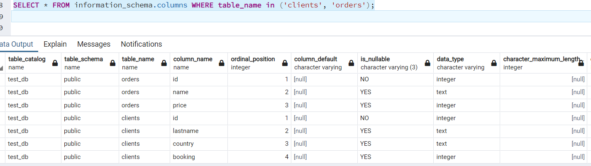
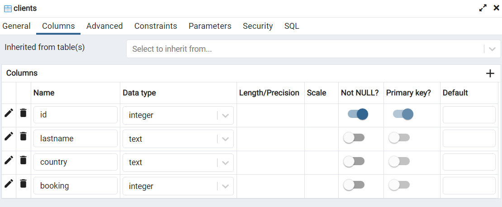
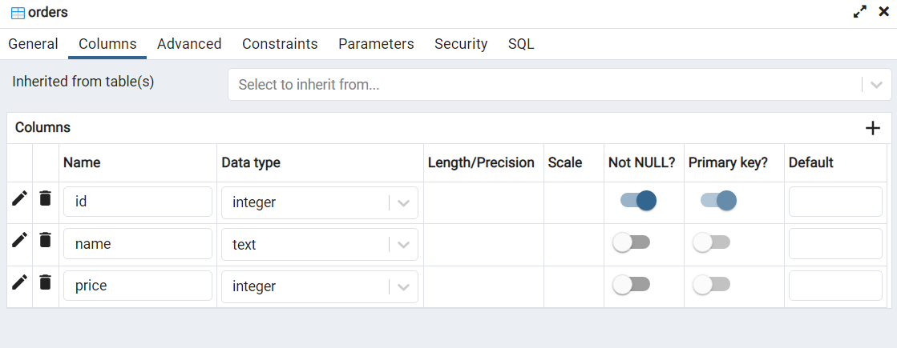
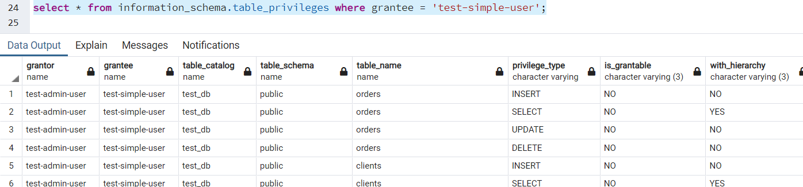
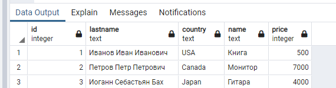
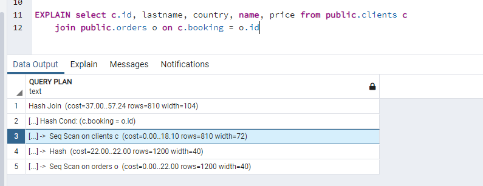

# Домашнее задание к занятию "6.2. SQL"

## Введение

Перед выполнением задания вы можете ознакомиться с 
[дополнительными материалами](https://github.com/netology-code/virt-homeworks/tree/master/additional/README.md).

## Задача 1

Используя docker поднимите инстанс PostgreSQL (версию 12) c 2 volume, 
в который будут складываться данные БД и бэкапы.

Приведите получившуюся команду или docker-compose манифест.

```
Docker-compose:
version: '3.5'
services:
  cg_post11_dev:
    container_name: postgre_edu
    restart: always
    build:
      context: .
      dockerfile: dockerfile
    user: root
    image: postgres:12
    env_file:
      - database.env # configure postgres
    volumes:
      - /home/turganovai/db/postgre_edu/data/:/var/lib/postgresql/data/ # persist data even if container shuts down
      - /home/turganovai/db/postgre_edu/backup/:/var/lib/postgresql/backup/ # persist data even if container shuts down
    ports:
      - "7007:5432"
      # - "7022:22"
    command: postgres -c config_file=/etc/postgresql.conf
    shm_size: '12gb' #<-- when RUNNING
    network_mode: bridge
```
```
Dockerfile:
FROM postgres:12.4
COPY postgresql.conf /etc/postgresql.conf

EXPOSE 5432
```
``` 
database.env:
POSTGRES_USER=locadm
POSTGRES_PASSWORD=Temp001
PGDATA=/var/lib/postgresql/data
```
```
# -----------------------------
# PostgreSQL configuration file
# -----------------------------

listen_addresses = '*'
max_connections = 500                   # (change requires restart)


# shared_buffers = 12GB                   # min 128kB
shared_buffers = 1GB                   # min 128kB
                                        # (change requires restart)                                        # supported by the operating system:
                                        #   mmap
                                        #   sysv
                                        #   windows
                                        # (change requires restart)
dynamic_shared_memory_type = posix      # the default is the first option

max_wal_size = 1GB
min_wal_size = 80MB
log_timezone = 'Europe/Moscow'

datestyle = 'iso, mdy'
timezone = 'Europe/Moscow'


lc_messages = 'en_US.utf8'                      # locale for system error message
                                        # strings
lc_monetary = 'en_US.utf8'                      # locale for monetary formatting
lc_numeric = 'en_US.utf8'                       # locale for number formatting
lc_time = 'en_US.utf8'                          # locale for time formatting

# default configuration for text search
default_text_search_config = 'pg_catalog.english'
```


## Задача 2

В БД из задачи 1: 
- создайте пользователя test-admin-user и БД test_db
- в БД test_db создайте таблицу orders и clients (спeцификация таблиц ниже)
- предоставьте привилегии на все операции пользователю test-admin-user на таблицы БД test_db
- создайте пользователя test-simple-user  
- предоставьте пользователю test-simple-user права на SELECT/INSERT/UPDATE/DELETE данных таблиц БД test_db

Таблица orders:
- id (serial primary key)
- наименование (string)
- цена (integer)

Таблица clients:
- id (serial primary key)
- фамилия (string)
- страна проживания (string, index)
- заказ (foreign key orders)
```
CREATE DATABASE test_db;
create user "test-admin-user" with password 'Temp001';
GRANT ALL PRIVILEGES ON DATABASE "test_db" to "test-admin-user";
ALTER ROLE "test-admin-user" WITH CREATEROLE;
```
```
--Зашел под новым пользователем "test-admin-user"
CREATE TABLE orders 
(
id integer, 
name text, 
price integer, 
PRIMARY KEY (id) 
);
CREATE TABLE clients 
(
	id integer PRIMARY KEY,
	lastname text,
	country text,
	booking integer,
	FOREIGN KEY (booking) REFERENCES orders (Id)
);
create user "test-simple-user" with password 'Temp001';
GRANT SELECT, INSERT, UPDATE, DELETE ON TABLE public.clients TO "test-simple-user";
GRANT SELECT, INSERT, UPDATE, DELETE ON TABLE public.orders TO "test-simple-user";
```
Приведите:
- итоговый список БД после выполнения пунктов выше,
  - описание таблиц (describe)
- SQL-запрос для выдачи списка пользователей с правами над таблицами test_db
- список пользователей с правами над таблицами test_db






## Задача 3

Используя SQL синтаксис - наполните таблицы следующими тестовыми данными:

Таблица orders

|Наименование|цена|
|------------|----|
|Шоколад| 10 |
|Принтер| 3000 |
|Книга| 500 |
|Монитор| 7000|
|Гитара| 4000|
```
insert into orders VALUES (1, 'Шоколад', 10), (2, 'Принтер', 3000), (3, 'Книга', 500), (4, 'Монитор', 7000), (5, 'Гитара', 4000);
```
Таблица clients

|ФИО|Страна проживания|
|------------|----|
|Иванов Иван Иванович| USA |
|Петров Петр Петрович| Canada |
|Иоганн Себастьян Бах| Japan |
|Ронни Джеймс Дио| Russia|
|Ritchie Blackmore| Russia|
```
insert into clients VALUES (1, 'Иванов Иван Иванович', 'USA'), (2, 'Петров Петр Петрович', 'Canada'), (3, 'Иоганн Себастьян Бах', 'Japan'), (4, 'Ронни Джеймс Дио', 'Russia'), (5, 'Ritchie Blackmore', 'Russia');
```

Используя SQL синтаксис:
- вычислите количество записей для каждой таблицы
```  
  select count (*) from orders;
  select count (*) from clients;
```
- приведите в ответе:
    - запросы 
    - результаты их выполнения.
```
Указаны выше
```
## Задача 4

Часть пользователей из таблицы clients решили оформить заказы из таблицы orders.

Используя foreign keys свяжите записи из таблиц, согласно таблице:

|ФИО|Заказ|
|------------|----|
|Иванов Иван Иванович| Книга |
|Петров Петр Петрович| Монитор |
|Иоганн Себастьян Бах| Гитара |

Приведите SQL-запросы для выполнения данных операций.
```
update clients set booking = 3 where id = 1;
update clients set booking = 4 where id = 2;
update clients set booking = 5 where id = 3;
```
Приведите SQL-запрос для выдачи всех пользователей, которые совершили заказ, а также вывод данного запроса.
````
select c.id, lastname, country, name, price from public.clients c
	join public.orders o on c.booking = o.id
````
Подсказк - используйте директиву `UPDATE`.

## Задача 5

Получите полную информацию по выполнению запроса выдачи всех пользователей из задачи 4 
(используя директиву EXPLAIN).

Приведите получившийся результат и объясните что значат полученные значения.


````
Структуру, этапность выполнения запроса. 
Время исполнения узлов, размер выборки данных на узлах, размер данных)
````
## Задача 6

Создайте бэкап БД test_db и поместите его в volume, предназначенный для бэкапов (см. Задачу 1).

Остановите контейнер с PostgreSQL (но не удаляйте volumes).

Поднимите новый пустой контейнер с PostgreSQL.

Восстановите БД test_db в новом контейнере.

Приведите список операций, который вы применяли для бэкапа данных и восстановления. 
````
docker exec -it bc4698029ada pg_dump  -U locadm test_db -f /var/lib/postgresql/backup/backup.sql
Остановка первого контейнера
~/gitlab/cg021_post_edu$ docker-compose down
Запуск второго контейнера
~/gitlab/cg022_post_edu$ docker-compose up -d
копирование бекапа, по идее не обязательно
cp /home/turganovai/db/postgre_edu/backup/backup.sql 99b086335539:/var/lib/postgresql/backup/ 
Восстановление:
turganovai@ch-32:~/db/postgre_edu2/backup$ docker exec -it  99b086335539 psql -U locadm -d test_db -f /var/lib/postgresql/backup/backup.sql
SET
SET
SET
SET
SET
 set_config 
------------
 
(1 row)

SET
SET
SET
SET
SET
SET
````
---

### Как cдавать задание

Выполненное домашнее задание пришлите ссылкой на .md-файл в вашем репозитории.

---
