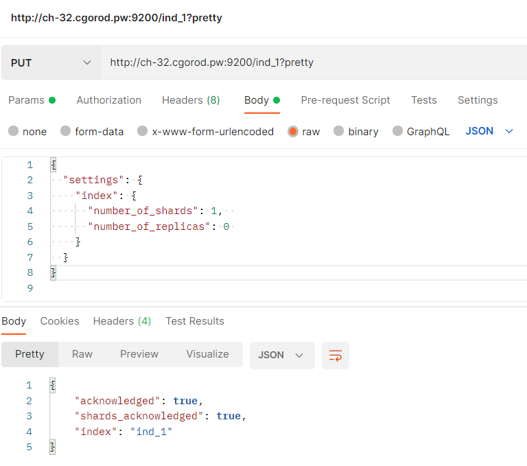
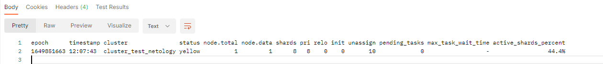
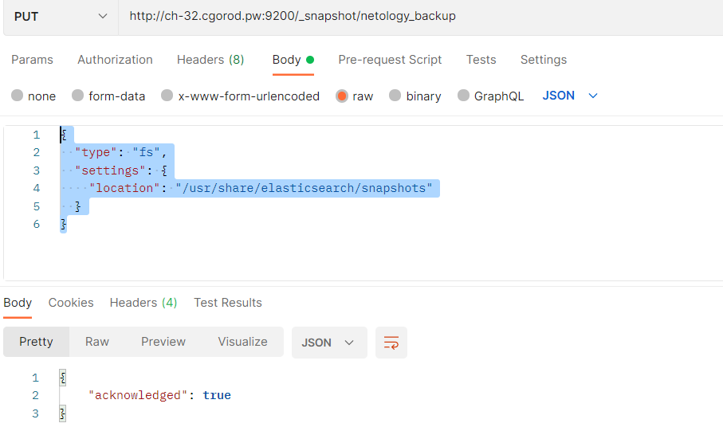
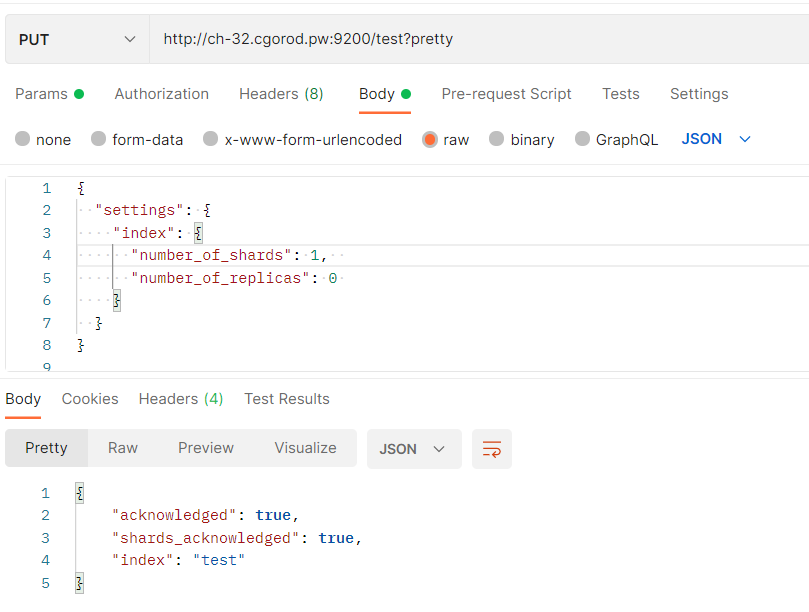
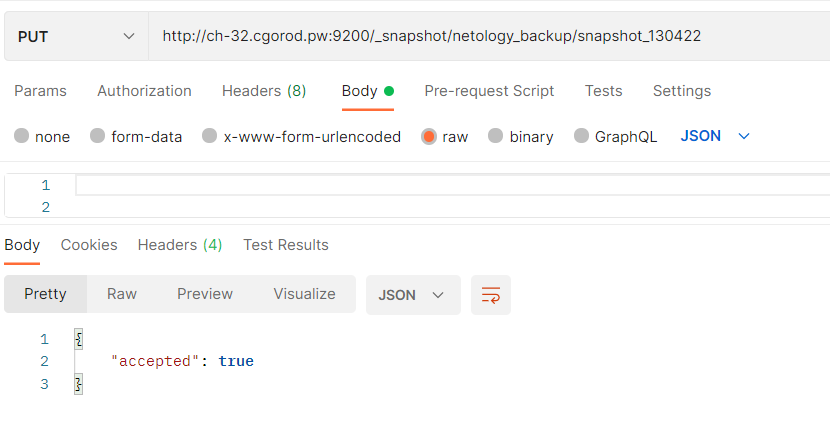
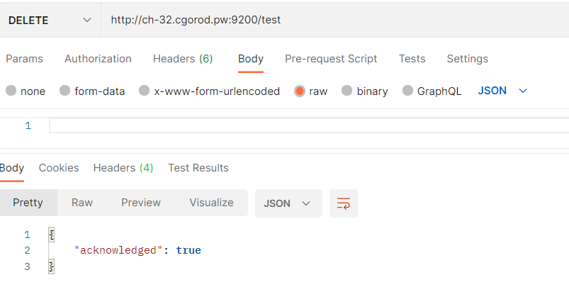
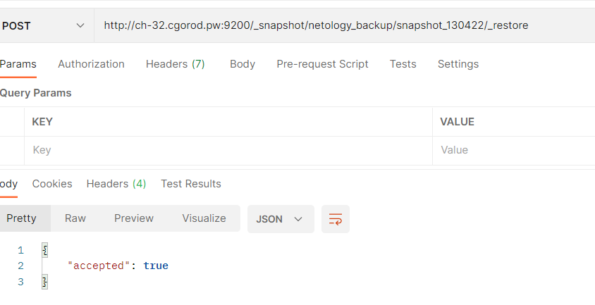

# Домашнее задание к занятию "6.5. Elasticsearch"

## Задача 1

В этом задании вы потренируетесь в:
- установке elasticsearch
- первоначальном конфигурировании elastcisearch
- запуске elasticsearch в docker

Используя докер образ [centos:7](https://hub.docker.com/_/centos) как базовый и 
[документацию по установке и запуску Elastcisearch](https://www.elastic.co/guide/en/elasticsearch/reference/current/targz.html):

- составьте Dockerfile-манифест для elasticsearch
- соберите docker-образ и сделайте `push` в ваш docker.io репозиторий
- запустите контейнер из получившегося образа и выполните запрос пути `/` c хост-машины

Требования к `elasticsearch.yml`:
- данные `path` должны сохраняться в `/var/lib`
- имя ноды должно быть `netology_test`

В ответе приведите:
- текст Dockerfile манифеста
- ссылку на образ в репозитории dockerhub
- ответ `elasticsearch` на запрос пути `/` в json виде

Подсказки:
- возможно вам понадобится установка пакета perl-Digest-SHA для корректной работы пакета shasum
- при сетевых проблемах внимательно изучите кластерные и сетевые настройки в elasticsearch.yml
- при некоторых проблемах вам поможет docker директива ulimit
- elasticsearch в логах обычно описывает проблему и пути ее решения

Далее мы будем работать с данным экземпляром elasticsearch.
```buildoutcfg
version: "3.5"

services:
  elasticsearch:
    container_name: es-container
    build: .
    environment:
      - xpack.security.enabled=false
    networks:
      - es-net
    ports:
      - 9200:9200

networks:
  es-net:
    driver: bridge
```

```buildoutcfg
# dockerfile
FROM elasticsearch:8.1.2

# Санкции, так что пришлось отказатся от такого подхода
# Вот такое теперь сообщение «The Amazon CloudFront distribution is configured to block access from your country»
# На прямое скачивание с сайте  https://artifacts.elastic.co

# RUN wget https://artifacts.elastic.co/downloads/elasticsearch/elasticsearch-8.1.2-darwin-x86_64.tar.gz
# RUN wget https://artifacts.elastic.co/downloads/elasticsearch/elasticsearch-8.1.1-linux-x86_64.tar.gz.sha512 
# RUN shasum -a 512 -c elasticsearch-8.1.1-linux-x86_64.tar.gz.sha512 
# RUN tar -xzf elasticsearch-8.1.1-linux-x86_64.tar.gz

USER root
RUN mkdir /var/lib/elasticsearch
RUN usermod -aG root elasticsearch
RUN chown elasticsearch -R /var/lib/elasticsearch

USER elasticsearch
COPY elasticsearch.yml /usr/share/elasticsearch/config

EXPOSE 9200
```
```buildoutcfg
Создал образ
https://hub.docker.com/repository/docker/aturganov/test_netology
```
```buildoutcfg
Запрос через Postman к базе:
{
    "name": "netology_test",
    "cluster_name": "cluster_test_netology",
    "cluster_uuid": "h_G1B6QgSYqVYxviAz6eRw",
    "version": {
        "number": "8.1.2",
        "build_flavor": "default",
        "build_type": "docker",
        "build_hash": "31df9689e80bad366ac20176aa7f2371ea5eb4c1",
        "build_date": "2022-03-29T21:18:59.991429448Z",
        "build_snapshot": false,
        "lucene_version": "9.0.0",
        "minimum_wire_compatibility_version": "7.17.0",
        "minimum_index_compatibility_version": "7.0.0"
    },
    "tagline": "You Know, for Search"
}
```
## Задача 2

В этом задании вы научитесь:
- создавать и удалять индексы
- изучать состояние кластера
- обосновывать причину деградации доступности данных

Ознакомтесь с [документацией](https://www.elastic.co/guide/en/elasticsearch/reference/current/indices-create-index.html) 
и добавьте в `elasticsearch` 3 индекса, в соответствии со таблицей:

| Имя | Количество реплик | Количество шард |
|-----|-------------------|-----------------|
| ind-1| 0 | 1 |
| ind-2 | 1 | 2 |
| ind-3 | 2 | 4 |

Получите список индексов и их статусов, используя API и **приведите в ответе** на задание.

Получите состояние кластера `elasticsearch`, используя API.

Как вы думаете, почему часть индексов и кластер находится в состоянии yellow?

Удалите все индексы.

**Важно**

При проектировании кластера elasticsearch нужно корректно рассчитывать количество реплик и шард,
иначе возможна потеря данных индексов, вплоть до полной, при деградации системы.
```
Пример команды
```

```buildoutcfg
GET _cat/indices
yellow open ind_3 IB1te1JNQzGp1GnQaSvyFg 4 2 0 0 900b 900b
yellow open ind_2 VakviSlqRPSv8zUNYs95Yw 2 1 0 0 450b 450b
green  open ind_1 -AbXWNJoQ8GGLwWMXEIK2Q 1 0 0 0 225b 225b
Как вы думаете, почему часть индексов и кластер находится в состоянии yellow?

```
Как вы думаете, почему часть индексов и кластер находится в состоянии yellow?
```buildoutcfg
10 шадров, реплики не подписаны. 
Для стабильности работы количество дата-од  должны быть больше или равно количеству реплик.

```
```buildoutcfg
GET _cat/health?v
```


## Задача 3

В данном задании вы научитесь:
- создавать бэкапы данных
- восстанавливать индексы из бэкапов

Создайте директорию `{путь до корневой директории с elasticsearch в образе}/snapshots`.

Используя API [зарегистрируйте](https://www.elastic.co/guide/en/elasticsearch/reference/current/snapshots-register-repository.html#snapshots-register-repository) 
данную директорию как `snapshot repository` c именем `netology_backup`.

**Приведите в ответе** запрос API и результат вызова API для создания репозитория.

Создайте индекс `test` с 0 реплик и 1 шардом и **приведите в ответе** список индексов.

[Создайте `snapshot`](https://www.elastic.co/guide/en/elasticsearch/reference/current/snapshots-take-snapshot.html) 
состояния кластера `elasticsearch`.

**Приведите в ответе** список файлов в директории со `snapshot`ами.

Удалите индекс `test` и создайте индекс `test-2`. **Приведите в ответе** список индексов.

[Восстановите](https://www.elastic.co/guide/en/elasticsearch/reference/current/snapshots-restore-snapshot.html) состояние
кластера `elasticsearch` из `snapshot`, созданного ранее. 

**Приведите в ответе** запрос к API восстановления и итоговый список индексов.

Подсказки:
- возможно вам понадобится доработать `elasticsearch.yml` в части директивы `path.repo` и перезапустить `elasticsearch`

```buildoutcfg
elasticsearch.yml добавил строку:
path.repo: /usr/share/elasticsearch/snapshots
dockerfile добавил:
RUN mkdir /usr/share/elasticsearch/snapshots
```

```
создание репозитария
```

```buildoutcfg

```
```buildoutcfg
добавление индекса test:
```

```buildoutcfg
Создание shapshot
```

---
```buildoutcfg
список файлов в папке
elasticsearch@2bf4a4e863c1:~/snapshots$ ls -l
total 36
-rw-rw-r-- 1 elasticsearch elasticsearch   848 Apr 13 13:46 index-0
-rw-rw-r-- 1 elasticsearch elasticsearch     8 Apr 13 13:46 index.latest
drwxrwxr-x 4 elasticsearch elasticsearch  4096 Apr 13 13:46 indices
-rw-rw-r-- 1 elasticsearch elasticsearch 18352 Apr 13 13:46 meta-UUVLwd6STZW1Ug05OUrkpQ.dat
-rw-rw-r-- 1 elasticsearch elasticsearch   363 Apr 13 13:46 snap-UUVLwd6STZW1Ug05OUrkpQ.dat
```
```buildoutcfg
Удаление индекса
```

```buildoutcfg
создал индекс test-2
{
    "acknowledged": true,
    "shards_acknowledged": true,
    "index": "test-2"
}
```
```buildoutcfg
Список индексов
health status index  uuid                   pri rep docs.count docs.deleted store.size pri.store.size
green  open   test-2 ZgOb4kIRS7iM24QqQP7oEA   1   0          0            0       225b           225b
```
```buildoutcfg
восстановление shapshot, обзор:
GET /_cat/snapshots
snapshot_130422 netology_backup SUCCESS 1649857581 13:46:21 1649857582 13:46:22 1s 2 2 0 2
```
```buildoutcfg
Восстановление 
```

```buildoutcfg
Обзор индексов после восстановления
_cat/indices?v
green open test-2 ZgOb4kIRS7iM24QqQP7oEA 1 0 0 0 225b 225b
green open test   RtwLEkPyTSSBPXBEvZzP6w 1 0 0 0 225b 225b
```

### Как cдавать задание

Выполненное домашнее задание пришлите ссылкой на .md-файл в вашем репозитории.

---
