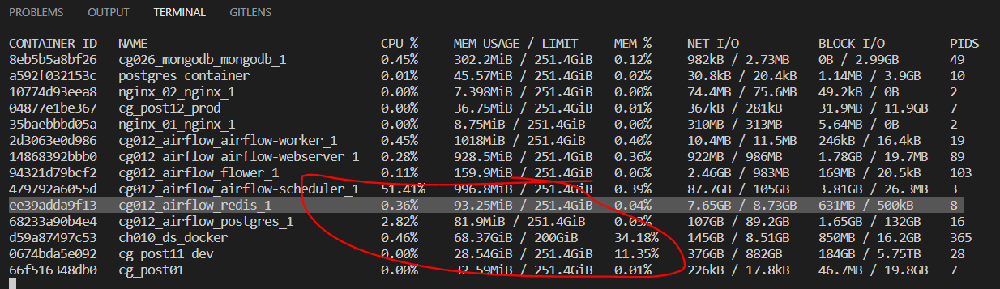

# Домашнее задание к занятию "6.6. Troubleshooting"

## Задача 1

Перед выполнением задания ознакомьтесь с документацией по [администрированию MongoDB](https://docs.mongodb.com/manual/administration/).

Пользователь (разработчик) написал в канал поддержки, что у него уже 3 минуты происходит CRUD операция в MongoDB и её 
нужно прервать. 

Вы как инженер поддержки решили произвести данную операцию:
- напишите список операций, которые вы будете производить для остановки запроса пользователя

```buildoutcfg
version: '3.5'

services:
  mongodb:
    image: mongo:5.0
    ports:
      - 27017:27017
    volumes:
      - ~/apps/mongo:/data/db
    environment:
      - MONGO_INITDB_ROOT_USERNAME=locadm
      - MONGO_INITDB_ROOT_PASSWORD=Temp001
# Подключение к базе в Shell
root@8eb5b5a8bf26:/# mongosh $MDB_CONNECTION_STRING;
Current Mongosh Log ID: 6257244ca81c1ead4754f75e
Connecting to:          mongodb://127.0.0.1:27017/?directConnection=true&serverSelectionTimeoutMS=2000&appName=mongosh+1.3.1
Using MongoDB:          5.0.7
Using Mongosh:          1.3.1

For mongosh info see: https://docs.mongodb.com/mongodb-shell/

To help improve our products, anonymous usage data is collected and sent to MongoDB periodically (https://www.mongodb.com/legal/privacy-policy).
You can opt-out by running the disableTelemetry() command.

```
```buildoutcfg
const database = 'test_db';
const collection = 'test_collection';
use(database);
db.createCollection(collection);
```
Тестовые данные
```
use('test_db');

db.test_collection.insert({title: "MySQL"})
db.test_collection.insert({title: "PostreSQL"})
db.test_collection.insert({title: "MongoDB"})
db.test_collection.insert([{title: "MS SQL"}, {title: "Oracle"}])
```
Поиск и удаление зависших операций в Mongodb
https://blog.mlab.com/2014/02/mongodb-currentop-killop/
https://cloud.yandex.ru/docs/managed-mongodb/tutorials/profiling

```
// Поиск операций к примеру со временем исполнения свыше 5 секунд
db.currentOp().inprog.forEach(
  function(op) {
    if(op.secs_running > 5) printjson(op);
  }
)
Output:
"opid": xxxxxxxx,

// Остановка операции
db.killOp(xxxxxxxx)
```
- предложите вариант решения проблемы с долгими (зависающими) запросами в MongoDB
```buildoutcfg
Выявление долгих запросов по логам и анализ производительности.
Команда db.setProfilingLevel(1 , {})
- параметры: slowms - тайминг на операцию в милисекундах, 
              sampleRate - доля операций для логирования.
operationProfiling.slowOpThreshold.
Использование профилировщика (c настройкой operationProfiling.slowOpThreshold - выделение медленных запросов), 
анализ Query Plan.

При формировании запросов find можно ограничить время исполнения запроса.
```
## Задача 2
Перед выполнением задания познакомьтесь с документацией по [Redis latency troobleshooting](https://redis.io/topics/latency).

Вы запустили инстанс Redis для использования совместно с сервисом, который использует механизм TTL. 
Причем отношение количества записанных key-value значений к количеству истёкших значений есть величина постоянная и
увеличивается пропорционально количеству реплик сервиса. 

При масштабировании сервиса до N реплик вы увидели, что:
- сначала рост отношения записанных значений к истекшим
- Redis блокирует операции записи

Как вы думаете, в чем может быть проблема?
```buildoutcfg
Редис ставить не стал, был уже установлен по цели airflow
root@ee39adda9f13:/data# redis-cli
127.0.0.1:6379> info
# Server
redis_version:6.2.6
redis_git_sha1:00000000
redis_git_dirty:0
redis_build_id:1527eab61b27d3bf
redis_mode:standalone
os:Linux 5.4.0-64-generic x86_64

Текущая ланетность: 
root@ee39adda9f13:/data# redis-cli --intrinsic-latency 100
Max latency so far: 1 microseconds.
Max latency so far: 17 microseconds.
Max latency so far: 19 microseconds.

Последние 10 записей по логи медленных операций, Redis работает в штатном режиме
root@ee39adda9f13:/data# redis-cli SLOWLOG GET 10
(empty array)

Потребление текущих ресурсов Redis Airflow
```

```buildoutcfg
Подключенных Slave 0 в стандартном пакете airflow
root@ee39adda9f13:/# redis-cli info replication
# Replication
role:master
connected_slaves:0
master_failover_state:no-failover
master_replid:699ef50ab8dcd526f0eeb16e3e3b31c955b2ff39
master_replid2:6bf7da1d3649ca6d08f987678e69efbee8dbd159
master_repl_offset:0
second_repl_offset:1
repl_backlog_active:0
repl_backlog_size:1048576
repl_backlog_first_byte_offset:0
repl_backlog_histlen:0

Подключение slave  производстви через /etc/redis/redis.conf. 
```
При масштабировании сервиса до N реплик вы увидели, что:
- сначала рост отношения записанных значений к истекшим
- Redis блокирует операции записи

Как вы думаете, в чем может быть проблема?
```buildoutcfg
Предполагаю, что любой новый slave увеличивает необходимые ресурсы. Требуется посмотреть текущую загрузку сервера.
https://redis.io/docs/reference/optimization/latency/
В соотствии с секцией 'Latency generated by expires' истечение ключей регулярно обновляется. Получается, что в единицу времени
поступило больше ключе и переполнился стек памяти. Если правильно понял перевод,
Redis блокирует запись новых, если истечение ключей не достигнет 25% от всех ключей.
```
```
Также.
В качестве дополнительной организации высокодоступных систем использует надстройка Redis Sentinel (некластеризован).
https://redis.io/docs/manual/sentinel/
Для организации восокодоступных систем рекомендуется организации не менее 2 слейвов на 1 мастер.
Redis Sentinel - это по сути надстройка над Redis-Server.
``` 
## Задача 3

Перед выполнением задания познакомьтесь с документацией по [Common Mysql errors](https://dev.mysql.com/doc/refman/8.0/en/common-errors.html).

Вы подняли базу данных MySQL для использования в гис-системе. При росте количества записей, в таблицах базы,
пользователи начали жаловаться на ошибки вида:
```python
InterfaceError: (InterfaceError) 2013: Lost connection to MySQL server during query u'SELECT..... '
```

Как вы думаете, почему это начало происходить и как локализовать проблему?

Какие пути решения данной проблемы вы можете предложить?
```buildoutcfg
Из документации
https://dev.mysql.com/doc/refman/8.0/en/error-lost-connection.html

Предлагается следующая рекомендация
Sometimes the “during query” form happens when millions of rows are being sent as part of one or more queries. 
If you know that this is happening, you should try increasing net_read_timeout from its default of 30 seconds to 60 seconds 
or longer, sufficient for the data transfer to complete.

Т.е. при росте объема данных по запросам предлагается увеличить настройку net_read_timeout, то есть увеличить врема на 
транспорт данных.

В нотации Python можно использовать следущие команды:
 
from sqlalchemy import create_engine

engine = create_engine(self.writer_url, 
                       connect_args={'connect_timeout': 120},
                        )
Также рекомендуют проверить наличие слабых соедениений, используюя команду SHOW GLOBAL STATUS LIKE 'Aborted_connects.
```

## Задача 4

Перед выполнением задания ознакомтесь со статьей [Common PostgreSQL errors](https://www.percona.com/blog/2020/06/05/10-common-postgresql-errors/) из блога Percona.

Вы решили перевести гис-систему из задачи 3 на PostgreSQL, так как прочитали в документации, что эта СУБД работает с 
большим объемом данных лучше, чем MySQL.

После запуска пользователи начали жаловаться, что СУБД время от времени становится недоступной. В dmesg вы видите, что:

`postmaster invoked oom-killer`

Как вы думаете, что происходит?


Как бы вы решили данную проблему?

---
```buildoutcfg
https://habr.com/ru/company/southbridge/blog/464245/
Данная проблема возникает в связи запросом большего количества памяти на процесс, чем доступно. Соотвественно, 
формируется процесс OOM Killer по завершению процесса.

Рекомендации, это оптимизация самих запросов и настроек базы данных. Увеличение свапинга, хотя это не самый хороший вариант. 
Увеличение физической памяти на сервере.
```

### Как cдавать задание

Выполненное домашнее задание пришлите ссылкой на .md-файл в вашем репозитории.

---
