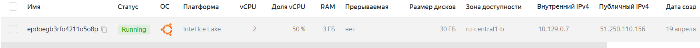
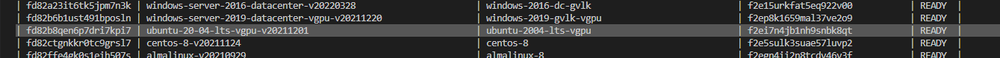
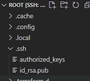
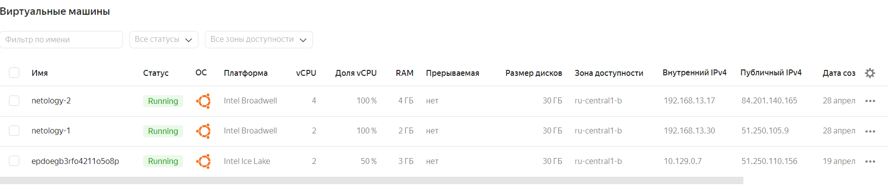

# Домашнее задание к занятию "7.2. Облачные провайдеры и синтаксис Terraform."

Зачастую разбираться в новых инструментах гораздо интересней понимая то, как они работают изнутри. 
Поэтому в рамках первого *необязательного* задания предлагается завести свою учетную запись в AWS (Amazon Web Services) или Yandex.Cloud.
Идеально будет познакомится с обоими облаками, потому что они отличаются. 

## Задача 1 (вариант с AWS). Регистрация в aws и знакомство с основами (необязательно, но крайне желательно).
```buildoutcfg
Увы, регистрация AWS не доступна для нашей страны (
```

Остальные задания можно будет выполнять и без этого аккаунта, но с ним можно будет увидеть полный цикл процессов. 

AWS предоставляет достаточно много бесплатных ресурсов в первый год после регистрации, подробно описано [здесь](https://aws.amazon.com/free/).
1. Создайте аккаут aws.
1. Установите c aws-cli https://aws.amazon.com/cli/.
1. Выполните первичную настройку aws-sli https://docs.aws.amazon.com/cli/latest/userguide/cli-configure-quickstart.html.
1. Создайте IAM политику для терраформа c правами
    * AmazonEC2FullAccess
    * AmazonS3FullAccess
    * AmazonDynamoDBFullAccess
    * AmazonRDSFullAccess
    * CloudWatchFullAccess
    * IAMFullAccess
1. Добавьте переменные окружения 
    ```
    export AWS_ACCESS_KEY_ID=(your access key id)
    export AWS_SECRET_ACCESS_KEY=(your secret access key)
    ```
1. Создайте, остановите и удалите ec2 инстанс (любой с пометкой `free tier`) через веб интерфейс. 

В виде результата задания приложите вывод команды `aws configure list`.

## Задача 1 (Вариант с Yandex.Cloud). Регистрация в ЯО и знакомство с основами (необязательно, но крайне желательно).

1. Подробная инструкция на русском языке содержится [здесь](https://cloud.yandex.ru/docs/solutions/infrastructure-management/terraform-quickstart).
2. Обратите внимание на период бесплатного использования после регистрации аккаунта.
```buildoutcfg
Создал машину (просто руками без терраформ)
```   

```
Получил токены (*** указал, чтобы не отображать реальные номера):
turganovai@vds2260027:~$ yc config list
token: AQAAA***gRddA8
cloud-id: b1go***fts0
folder-id: b1gk***uii66ht
compute-default-zone: ru-central1-b

Установил visual studio code c extention terraform
```

3. Используйте раздел "Подготовьте облако к работе" для регистрации аккаунта. Далее раздел "Настройте провайдер" для подготовки
базового терраформ конфига.
```buildoutcfg
Развернул сервер в Казахстане дабы обойти санкционные блокировки
Результат:
root@netology01:~/terraform_prj# terraform -v
Terraform v1.1.9
on linux_amd64
+ provider registry.terraform.io/yandex-cloud/yandex v0.74.0
```
   
4. Воспользуйтесь [инструкцией](https://registry.terraform.io/providers/yandex-cloud/yandex/latest/docs) на сайте терраформа, что бы 
не указывать авторизационный токен в коде, а терраформ провайдер брал его из переменных окружений.
```buildoutcfg
https://medium.com/codex/how-to-use-environment-variables-on-terraform-f2ab6f95f82d
Развернул сервер в Казахстане дабы обойти санкционные блокировки
Результат:
root@netology01:~/terraform_prj# terraform -v
Terraform v1.1.9
on linux_amd64
+ provider registry.terraform.io/yandex-cloud/yandex v0.74.0
```
https://learn.hashicorp.com/tutorials/terraform/variables
```buildoutcfg
Типовой подход
Создаем файл описания переменных
variables.tf
variable "yandex_token" {
  description   = "yandex_token"
  type          = string
}
terraform.tfvars
yandex_token = "AQAAAABeagchAATuwY8-jsMf5EZol-5ZsgRddA8"

root@netology01:~/terraform_prj# terraform apply

No changes. Your infrastructure matches the configuration.

Terraform has compared your real infrastructure against your configuration and found no differences, so no changes are needed.

Apply complete! Resources: 0 added, 0 changed, 0 destroyed.

Проверка присвоения
root@netology01:~/terraform_prj# terraform console
> var.yandex_token
"AQAAAA***5ZsgRddA8"

Другой вариант через переменные окружения:
root@netology01:~/terraform_prj# export TF_VAR_yandex_token_export='AQAAAABeagchAATuwY8-jsMf5EZol-5ZsgRddA8'
root@netology01:~/terraform_prj# env
...
TF_VAR_yandex_token_export=AQAAAABeagchAATuwY8-jsMf5EZol-5ZsgRddA8
...
Настройка подхватилась из переменной окружения
root@netology01:~/terraform_prj# terraform console
> var.yandex_token_export
"AQAAA***gRddA8"
```


## Задача 2. Создание aws ec2 или yandex_compute_instance через терраформ. 

1. В каталоге `terraform` вашего основного репозитория, который был создан в начале курсе, создайте файл `main.tf` и `versions.tf`.
2. Зарегистрируйте провайдер 
   1. для [aws](https://registry.terraform.io/providers/hashicorp/aws/latest/docs). В файл `main.tf` добавьте
   блок `provider`, а в `versions.tf` блок `terraform` с вложенным блоком `required_providers`. Укажите любой выбранный вами регион 
   внутри блока `provider`.
   2. либо для [yandex.cloud](https://registry.terraform.io/providers/yandex-cloud/yandex/latest/docs). Подробную инструкцию можно найти 
   [здесь](https://cloud.yandex.ru/docs/solutions/infrastructure-management/terraform-quickstart).
```buildoutcfg

```
3. Внимание! В гит репозиторий нельзя пушить ваши личные ключи доступа к аккаунту. Поэтому в предыдущем задании мы указывали
их в виде переменных окружения.
```buildoutcfg
Ставим Yandex CLI для проверки результатов (прямой рабочий стол на инстанс в яндекс-облаке)
root@netology01:~/terraform_prj# curl -sSL https://storage.yandexcloud.net/yandexcloud-yc/install.sh | bash
Downloading yc 0.90.0
  % Total    % Received % Xferd  Average Speed   Time    Time     Time  Current
                                 Dload  Upload   Total   Spent    Left  Speed
100 83.5M  100 83.5M    0     0  6736k      0  0:00:12  0:00:12 --:--:-- 6831k
Yandex Cloud CLI 0.90.0 linux/amd64
root@netology01:~# bash

Установил типовые настройки (описывать не буду)
Use 'yc init' for interactive profile configuration, using OAuth token or set one property using:
    yc config set token <yandex-cloud-OAuth-token>
    yc config set federation-id <FEDERATION-ID>
    yc config set service-account-key <path-to-service-account-key-file>
    yc config set instance-service-account true
    
 Просматриваем имиджи 
 yc compute image list --folder-id standard-images
 Выбираем имидж
 ```
 
 ```buildoutcfg
Конфигурируем провайдера
terraform {
 required_providers {
   yandex = {
     source = "yandex-cloud/yandex"
   }
 }
 required_version = ">= 0.13"
}

provider "yandex" {
  token = var.yandex_token_export
  cloud_id  = "b1go***ts0"
  folder_id = "b1g***uii66ht"
  zone      = "***"
}   
```
4. В файле `main.tf` воспользуйтесь блоком `data "aws_ami` для поиска ami образа последнего Ubuntu.  
5. В файле `main.tf` создайте рессурс 
   1. либо [ec2 instance](https://registry.terraform.io/providers/hashicorp/aws/latest/docs/resources/instance).
   Постарайтесь указать как можно больше параметров для его определения. Минимальный набор параметров указан в первом блоке 
   `Example Usage`, но желательно, указать большее количество параметров.
   2. либо [yandex_compute_image](https://registry.terraform.io/providers/yandex-cloud/yandex/latest/docs/resources/compute_image).
```buildoutcfg
Завел SSH ключ
```

https://cloud.yandex.ru/docs/tutorials/infrastructure-management/terraform-quickstart\
```buildoutcfg
Добавил в main.tf с соотвествии в с примером конфиги двух серверов 2CPU/2GB 4CPU/4GB:

terraform {
 required_providers {
   yandex = {
     source = "yandex-cloud/yandex"
   }
 }
 required_version = ">= 0.13"
}

provider "yandex" {
  token = var.yandex_token_export
  cloud_id  = "b1goo***vefts0"
  folder_id = "b1gkg***uii66ht"
  zone      = "***"
}   

# Настройка машины
resource "yandex_compute_instance" "vm-1" {
  name = "netology-1"

  resources {
    cores  = 1
    memory = 1
  }

  boot_disk {
    initialize_params {
      #image_id = "fd82b8qen6p7dri7kpi7"
      image_id = "fd87va5cc00gaq2f5qfb"
    }
  }

  network_interface {
    subnet_id = yandex_vpc_subnet.subnet-1.id
    nat       = true
  }

  metadata = {
    ssh-keys = "ubuntu:${file("~/.ssh/id_rsa.pub")}"
    user_data = "${file("~/terraform_prj/cloud_config.yaml")}"
  }
}

resource "yandex_compute_instance" "vm-2" {
  name = "netology-2"

  resources {
    cores  = 2
    memory = 2
  }

  boot_disk {
    initialize_params {
      image_id = "fd87va5cc00gaq2f5qfb"
    }
  }

  network_interface {
    subnet_id = yandex_vpc_subnet.subnet-1.id
    nat       = true
  }

  metadata = {
    ssh-keys = "ubuntu:${file("~/.ssh/id_rsa.pub")}"
    user_data = "${file("~/terraform_prj/cloud_config.yaml")}"
  }
}

resource "yandex_vpc_network" "network-1" {
  name = "network1"
}

resource "yandex_vpc_subnet" "subnet-1" {
  name           = "subnet1"
  zone           = "ru-central1-b"
  network_id     = yandex_vpc_network.network-1.id
  v4_cidr_blocks = ["192.168.13.0/24"]
}

output "internal_ip_address_vm_1" {
  value = yandex_compute_instance.vm-1.network_interface.0.ip_address
}

output "internal_ip_address_vm_2" {
  value = yandex_compute_instance.vm-2.network_interface.0.ip_address
}


output "external_ip_address_vm_1" {
  value = yandex_compute_instance.vm-1.network_interface.0.nat_ip_address
}

output "external_ip_address_vm_2" {
  value = yandex_compute_instance.vm-2.network_interface.0.nat_ip_address
}


Создал настройку пользователей cloud_config.yaml:
#cloud-config
ssh_pwauth: no
users:
  - name: turganovai
    sudo: ALL=(ALL) NOPASSWD:ALL
    shell: /bin/bash
    ssh_authorized_keys:
      - "ssh-rsa AAAAB3NzaC1***

root@netology01:~# terraform validate
Success! The configuration is valid.

root@netology01:~# terraform fmt

root@netology01:~/terraform_prj# terraform fmt
main.tf
variables.tf
```

````buildoutcfg
root@netology01:~/terraform_prj# terraform plan

Terraform used the selected providers to generate the following execution plan. Resource actions are indicated with the following symbols:
  + create

Terraform will perform the following actions:

  # yandex_compute_instance.vm-1 will be created
  + resource "yandex_compute_instance" "vm-1" {
      + created_at                = (known after apply)
      + folder_id                 = (known after apply)
      + fqdn                      = (known after apply)
      + hostname                  = (known after apply)
      + id                        = (known after apply)
      + metadata                  = {
          + "ssh-keys"  = <<-EOT
                ubuntu:ssh-rsa AAAAB3NzaC1yc2EAAAADAQABAAA*******D3wPUfviYb0ecbAdHhQAJCnCCPayVqXQ8YcGfzR7qwfzW7b2YjUCKuc4DXJO7+iU2FoQgxIBomrWvmclRGDYMfUShRYr6worwGGUfZQtj0iuGsAJ/D0vatCKnM7VBCJXYqGPv1VYoHav20jlaRZ7GOiHj2kYN2oXb68MudtmZBx8F56UB2OA3RMIPNmlsx9cvCXbeMqhxNXiXvMJRfVZsaVHj95x4rx//T0WCxoHtTG7TvUo2U3MTuy+j pgk\turganovai@Turganov-15IL
            EOT
          + "user_data" = <<-EOT
                #cloud-config
                ssh_pwauth: no
                users:
                  - name: turganovai
                    sudo: ALL=(ALL) NOPASSWD:ALL
                    shell: /bin/bash
                    ssh_authorized_keys:
                      - "ssh-rsa AAAAB3NzaC1yc2*********R7qwfzW7b2YjUCKuc4DXJO7+iU2FoQgxIBomrWvmclRGDYMfUShRYr6worwGGUfZQtj0iuGsAJ/D0vatCKnM7VBCJXYqGPv1VYoHav20jlaRZ7GOiHj2kYN2oXb68MudtmZBx8F56UB2OA3RMIPNmlsx9cvCXbeMqhxNXiXvMJRfVZsaVHj95x4rx//T0WCxoHtTG7TvUo2U3MTuy+j pgk\turganovai@Turganov-15IL"
            EOT
        }
      + name                      = "netology-1"
      + network_acceleration_type = "standard"
      + platform_id               = "standard-v1"
      + service_account_id        = (known after apply)
      + status                    = (known after apply)
      + zone                      = (known after apply)

      + boot_disk {
          + auto_delete = true
          + device_name = (known after apply)
          + disk_id     = (known after apply)
          + mode        = (known after apply)

          + initialize_params {
              + block_size  = (known after apply)
              + description = (known after apply)
              + image_id    = "fd87va5cc00gaq2f5qfb"
              + name        = (known after apply)
              + size        = (known after apply)
              + snapshot_id = (known after apply)
              + type        = "network-hdd"
            }
        }

      + network_interface {
          + index              = (known after apply)
          + ip_address         = (known after apply)
          + ipv4               = true
          + ipv6               = (known after apply)
          + ipv6_address       = (known after apply)
          + mac_address        = (known after apply)
          + nat                = true
          + nat_ip_address     = (known after apply)
          + nat_ip_version     = (known after apply)
          + security_group_ids = (known after apply)
          + subnet_id          = (known after apply)
        }

      + placement_policy {
          + host_affinity_rules = (known after apply)
          + placement_group_id  = (known after apply)
        }

      + resources {
          + core_fraction = 100
          + cores         = 2
          + memory        = 2
        }

      + scheduling_policy {
          + preemptible = (known after apply)
        }
    }

  # yandex_compute_instance.vm-2 will be created
  + resource "yandex_compute_instance" "vm-2" {
      + created_at                = (known after apply)
      + folder_id                 = (known after apply)
      + fqdn                      = (known after apply)
      + hostname                  = (known after apply)
      + id                        = (known after apply)
      + metadata                  = {
          + "ssh-keys"  = <<-EOT
                ubuntu:ssh-rsa AAAAB3NzaC1yc******9wPUfviYb0ecbAdHhQAJCnCCPayVqXQ8YcGfzR7qwfzW7b2YjUCKuc4DXJO7+iU2FoQgxIBomrWvmclRGDYMfUShRYr6worwGGUfZQtj0iuGsAJ/D0vatCKnM7VBCJXYqGPv1VYoHav20jlaRZ7GOiHj2kYN2oXb68MudtmZBx8F56UB2OA3RMIPNmlsx9cvCXbeMqhxNXiXvMJRfVZsaVHj95x4rx//T0WCxoHtTG7TvUo2U3MTuy+j pgk\turganovai@Turganov-15IL
            EOT
          + "user_data" = <<-EOT
                #cloud-config
                ssh_pwauth: no
                users:
                  - name: turganovai
                    sudo: ALL=(ALL) NOPASSWD:ALL
                    shell: /bin/bash
                    ssh_authorized_keys:
                      - "ssh-rsa AAAAB3NzaC1y*******Tb0ecbAdHhQAJCnCCPayVqXQ8YcGfzR7qwfzW7b2YjUCKuc4DXJO7+iU2FoQgxIBomrWvmclRGDYMfUShRYr6worwGGUfZQtj0iuGsAJ/D0vatCKnM7VBCJXYqGPv1VYoHav20jlaRZ7GOiHj2kYN2oXb68MudtmZBx8F56UB2OA3RMIPNmlsx9cvCXbeMqhxNXiXvMJRfVZsaVHj95x4rx//T0WCxoHtTG7TvUo2U3MTuy+j pgk\turganovai@Turganov-15IL"
            EOT
        }
      + name                      = "netology-2"
      + network_acceleration_type = "standard"
      + platform_id               = "standard-v1"
      + service_account_id        = (known after apply)
      + status                    = (known after apply)
      + zone                      = (known after apply)

      + boot_disk {
          + auto_delete = true
          + device_name = (known after apply)
          + disk_id     = (known after apply)
          + mode        = (known after apply)

          + initialize_params {
              + block_size  = (known after apply)
              + description = (known after apply)
              + image_id    = "fd87va5cc00gaq2f5qfb"
              + name        = (known after apply)
              + size        = (known after apply)
              + snapshot_id = (known after apply)
              + type        = "network-hdd"
            }
        }

      + network_interface {
          + index              = (known after apply)
          + ip_address         = (known after apply)
          + ipv4               = true
          + ipv6               = (known after apply)
          + ipv6_address       = (known after apply)
          + mac_address        = (known after apply)
          + nat                = true
          + nat_ip_address     = (known after apply)
          + nat_ip_version     = (known after apply)
          + security_group_ids = (known after apply)
          + subnet_id          = (known after apply)
        }

      + placement_policy {
          + host_affinity_rules = (known after apply)
          + placement_group_id  = (known after apply)
        }

      + resources {
          + core_fraction = 100
          + cores         = 4
          + memory        = 4
        }

      + scheduling_policy {
          + preemptible = (known after apply)
        }
    }

  # yandex_vpc_network.network-1 will be created
  + resource "yandex_vpc_network" "network-1" {
      + created_at                = (known after apply)
      + default_security_group_id = (known after apply)
      + folder_id                 = (known after apply)
      + id                        = (known after apply)
      + labels                    = (known after apply)
      + name                      = "network1"
      + subnet_ids                = (known after apply)
    }

  # yandex_vpc_subnet.subnet-1 will be created
  + resource "yandex_vpc_subnet" "subnet-1" {
      + created_at     = (known after apply)
      + folder_id      = (known after apply)
      + id             = (known after apply)
      + labels         = (known after apply)
      + name           = "subnet1"
      + network_id     = (known after apply)
      + v4_cidr_blocks = [
          + "192.168.13.0/24",
        ]
      + v6_cidr_blocks = (known after apply)
      + zone           = "ru-central1-b"
    }

Plan: 4 to add, 0 to change, 0 to destroy.

Changes to Outputs:
  + external_ip_address_vm_1 = (known after apply)
  + external_ip_address_vm_2 = (known after apply)
  + internal_ip_address_vm_1 = (known after apply)
  + internal_ip_address_vm_2 = (known after apply)

─────────────────────────────────────────────────────────────────────────────────────────────────────────────────────────────────────────────────────────────────────────────────────────────────────────────────────────────────────────

Note: You didn't use the -out option to save this plan, so Terraform can't guarantee to take exactly these actions if you run "terraform apply" now.
````
6. Также в случае использования aws:
   1. Добавьте data-блоки `aws_caller_identity` и `aws_region`.
   2. В файл `outputs.tf` поместить блоки `output` с данными об используемых в данный момент: 
       * AWS account ID,
       * AWS user ID,
       * AWS регион, который используется в данный момент, 
       * Приватный IP ec2 инстансы,
       * Идентификатор подсети в которой создан инстанс.  
7. Если вы выполнили первый пункт, то добейтесь того, что бы команда `terraform plan` выполнялась без ошибок. 
```buildoutcfg
Do you want to perform these actions?
  Terraform will perform the actions described above.
  Only 'yes' will be accepted to approve.

  Enter a value: yes

yandex_compute_instance.vm-1: Modifying... [id=epdnekm4hhfqpgc9rdkc]
yandex_compute_instance.vm-2: Modifying... [id=epd4krhh6hr0o1spn6gq]
yandex_compute_instance.vm-1: Modifications complete after 2s [id=epdnekm4hhfqpgc9rdkc]
yandex_compute_instance.vm-2: Still modifying... [id=epd4krhh6hr0o1spn6gq, 10s elapsed]
yandex_compute_instance.vm-2: Still modifying... [id=epd4krhh6hr0o1spn6gq, 20s elapsed]
yandex_compute_instance.vm-2: Modifications complete after 26s [id=epd4krhh6hr0o1spn6gq]

Apply complete! Resources: 0 added, 2 changed, 0 destroyed.

Outputs:

external_ip_address_vm_1 = "51.250.105.9"
external_ip_address_vm_2 = "62.84.123.164"
internal_ip_address_vm_1 = "192.168.13.30"
internal_ip_address_vm_2 = "192.168.13.17"
```
```buildoroot@netology01:~/terraform_prj# yc compute instance list
+----------------------+------------+---------------+---------+----------------+---------------+
|          ID          |    NAME    |    ZONE ID    | STATUS  |  EXTERNAL IP   |  INTERNAL IP  |
+----------------------+------------+---------------+---------+----------------+---------------+
| epd4krhh6hr0o1spn6gq | netology-2 | ru-central1-b | RUNNING | 84.201.140.165 | 192.168.13.17 |
| epdnekm4hhfqpgc9rdkc | netology-1 | ru-central1-b | RUNNING | 51.250.105.9   | 192.168.13.30 |
| epdoegb3rfo4211o5o8p |            | ru-central1-b | RUNNING | 51.250.110.156 | 10.129.0.7    |
+----------------------+------------+---------------+---------+----------------+---------------+
Два инстанса в соотвествии с tf plan и последний создан руками.
```
```buildoutcfg
root@netology01:~/terraform_prj# yc vpc network list
+----------------------+----------+
|          ID          |   NAME   |
+----------------------+----------+
| enp23786k25r681ctn1t | default  |
| enpe3epii86iu8oic42h | network1 |
+----------------------+----------+
```
```buildoutcfg
root@netology01:~/terraform_prj# yc compute instance get epdnekm4hhfqpgc9rdkc
id: epdnekm4hhfqpgc9rdkc
folder_id: b1gkgthf18fqkuii66ht
created_at: "2022-04-28T11:38:11Z"
name: netology-1
zone_id: ru-central1-b
platform_id: standard-v1
resources:
  memory: "2147483648"
  cores: "2"
  core_fraction: "100"
status: RUNNING
boot_disk:
  mode: READ_WRITE
  device_name: epdk7nbr8gucv8c1m4jg
  auto_delete: true
  disk_id: epdk7nbr8gucv8c1m4jg
network_interfaces:
- index: "0"
  mac_address: d0:0d:17:75:2c:48
  subnet_id: e2l1cdg7vknq8868c6dc
  primary_v4_address:
    address: 192.168.13.30
    one_to_one_nat:
      address: 51.250.105.9
      ip_version: IPV4
fqdn: epdnekm4hhfqpgc9rdkc.auto.internal
scheduling_policy: {}
network_settings:
  type: STANDARD
placement_policy: {}

root@netology01:~/terraform_prj# yc compute instance get epd4krhh6hr0o1spn6gq
id: epd4krhh6hr0o1spn6gq
folder_id: b1gkgthf18fqkuii66ht
created_at: "2022-04-28T11:33:43Z"
name: netology-2
zone_id: ru-central1-b
platform_id: standard-v1
resources:
  memory: "4294967296"
  cores: "4"
  core_fraction: "100"
status: RUNNING
boot_disk:
  mode: READ_WRITE
  device_name: epdddbes2oqbcvsbrrv1
  auto_delete: true
  disk_id: epdddbes2oqbcvsbrrv1
network_interfaces:
- index: "0"
  mac_address: d0:0d:4a:6e:31:34
  subnet_id: e2l1cdg7vknq8868c6dc
  primary_v4_address:
    address: 192.168.13.17
    one_to_one_nat:
      address: 84.201.140.165
      ip_version: IPV4
fqdn: epd4krhh6hr0o1spn6gq.auto.internal
scheduling_policy: {}
network_settings:
  type: STANDARD
placement_policy: {}
```


В качестве результата задания предоставьте:
1. Ответ на вопрос: при помощи какого инструмента (из разобранных на прошлом занятии) можно создать свой образ ami?
1. Ссылку на репозиторий с исходной конфигурацией терраформа.  
```
Ссылка на проект
```
 https://github.com/aturganov/terraform_1

---

### Как cдавать задание

Выполненное домашнее задание пришлите ссылкой на .md-файл в вашем репозитории.

---

